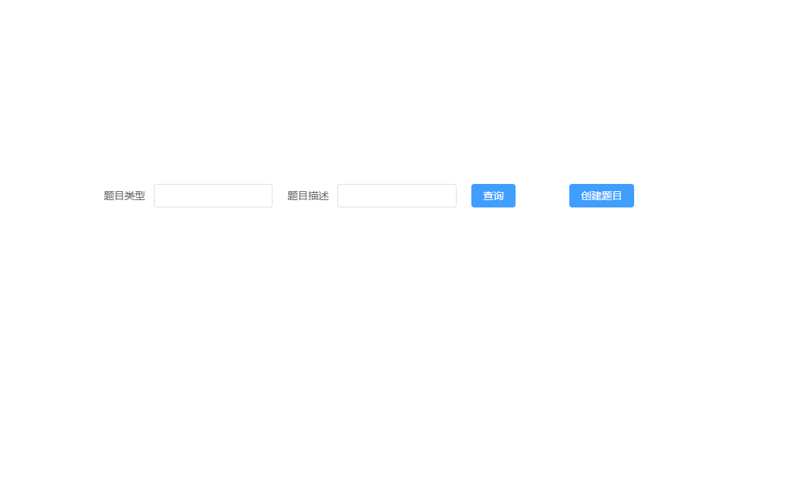
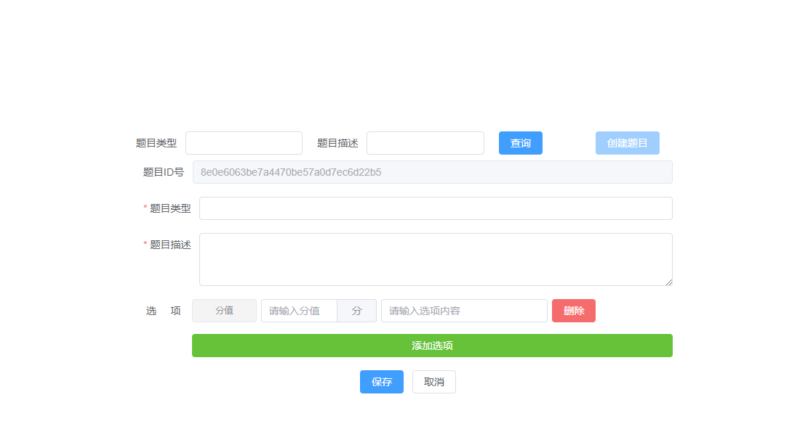
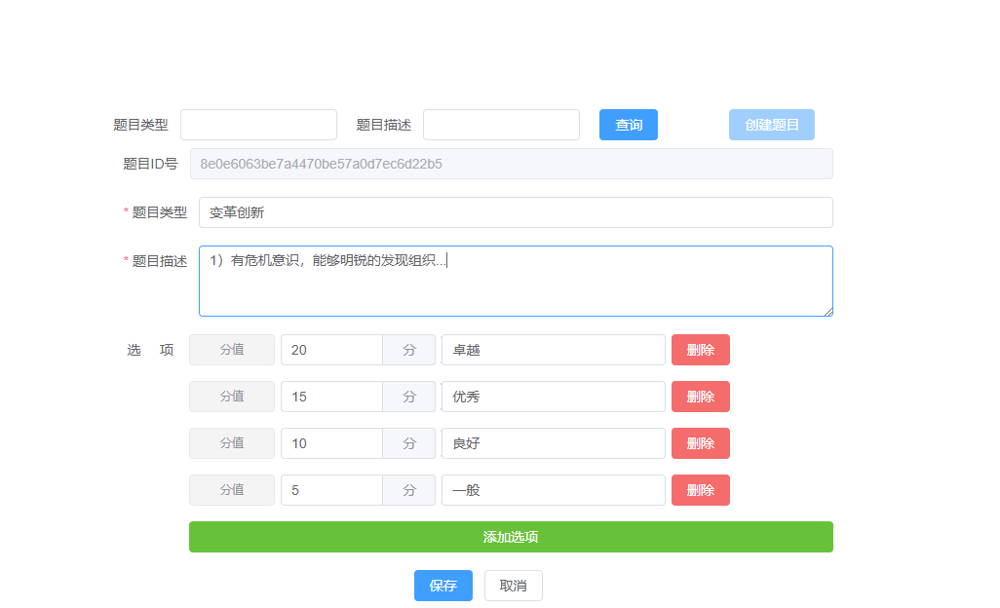
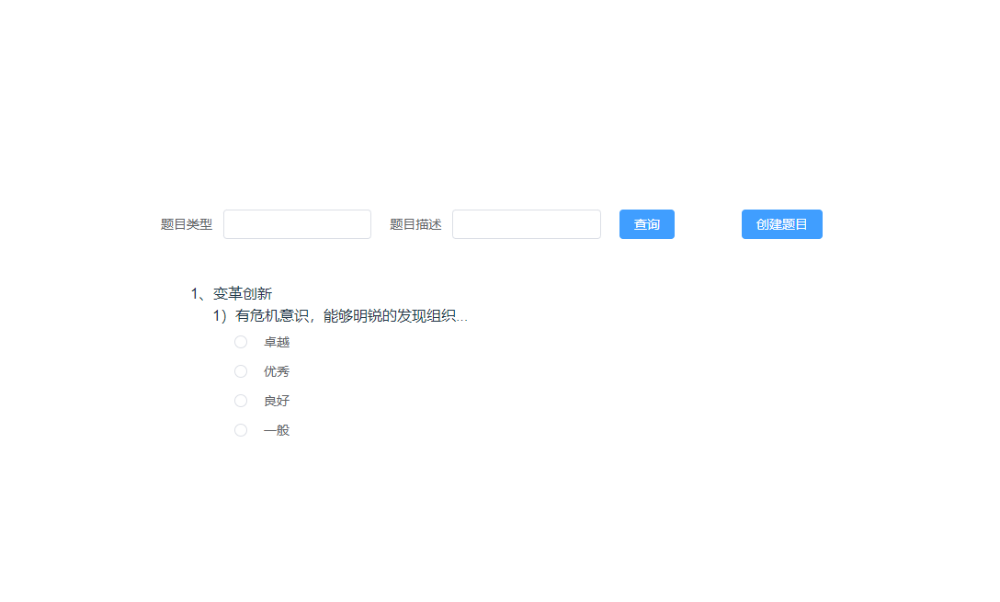

### 使用技术
Vue3 + Element-Plus
### 安装依赖
```
pnpm install
```

### 运行
```
pnpm dev
```

### 显示效果

<div style="text-align: center">图1</div>
<br/>


<div style="text-align: center">图2</div>
<br/>


<div style="text-align: center">图3</div>
<br/>


<div style="text-align: center">图4</div>
<br/>

